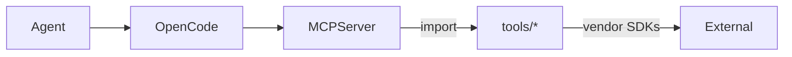

# Tools

## Purpose
<!-- readme:purpose-start -->
Home for reusable, battle‑tested Python utilities that MCP servers adapt into agent‑callable tools. Keep business logic here; keep MCP servers thin adapters.
<!-- readme:purpose-end -->

### Architecture
<!-- readme:architecture-start -->
Pure Python modules with explicit, documented functions. MCP servers import these symbols and expose them as tools.



Conventions

- Deterministic function signatures and return shapes
- Verbose docstrings, logging, and input validation
- Do NOT load .env here; env is loaded once at server startup and read via os.getenv
<!-- readme:architecture-end -->

### Contents
<!-- readme:contents-start -->
```text
tools/
├── exa_tools.py  # search and deep content tools (requires separate SDK)
└── README.md     # This file
```
<!-- readme:contents-end -->

### Doc Refs
<!-- readme:doc-refs-start -->
- mcp_servers/README.md – how these functions get exported to agents
- opencode.json – which MCP servers OpenCode launches
- .opencode/agent/single-newsletter-agent.md – how tools are used in phases
<!-- readme:doc-refs-end -->

### Test Refs
<!-- readme:test-refs-start -->
Quick local checks (using FastMCP Client via the server that imports these):

- uvx --with fastmcp python - << 'PY'
  import asyncio
  from fastmcp import Client
  async def main():
      client = Client("mcp_servers/generic_server.py")
      async with client:
          tools = await client.list_tools()
          print("TOOLS:", [t.name for t in tools])
  asyncio.run(main())
  PY

When calling tools that reach external services, ensure all required env keys are in .env.
<!-- readme:test-refs-end -->

## Adding tools (patterns and guidance)

There are four supported patterns to expose functions in tools/ as MCP tools:

1) Plain function with optional @tool_meta (recommended)

- Keep it simple: write a normal, well-documented Python function
- Optionally decorate with tool_meta to override name/description/tags
- The server discovers and registers it automatically

```python
from mcp_servers.tooling import tool_meta

@tool_meta(name="say_hello", description="Return a greeting", tags={"demo"})
def say_hello(name: str) -> dict:
    """Return a friendly greeting.

    Args:
        name: Person to greet
    Returns:
        dict: {"message": "Hello, <name>!"}
    """
    return {"message": f"Hello, {name}!"}
```

1) TOOLS = [fn, ...]

- Export a top-level list named TOOLS with callables to expose
- Good when you want to keep explicit control without annotations

```python
def add(a: int, b: int) -> int:
    """Return a + b."""
    return a + b

TOOLS = [add]
```

1) TOOL_SPECS = [ToolSpec(...), ...]

- Full declarative control without importing FastMCP in tools/
- Lets you specify name/description/tags independent of function name

```python
from mcp_servers.tooling import ToolSpec

def ping() -> dict:
    """Healthcheck."""
    return {"ok": True}

TOOL_SPECS = [
    ToolSpec(func=ping, name="ping", description="Healthcheck tool", tags={"ops"})
]
```

1) register(mcp)

- For advanced cases: define a function register(mcp) and use the @mcp.tool decorator
- Use sparingly; prefer the simpler patterns above

```python
def register(mcp):
    @mcp.tool(name="time_now", description="Current timestamp")
    def time_now() -> str:
        import datetime
        return datetime.datetime.now().isoformat()
```

Validation rules enforced by the server:

- All tool functions must have an explicit return annotation (not Any)
- No *args or **kwargs — parameters must be explicit and serializable
- Optional parameters are allowed; exclude_args can only target optional params
- Names must be unique across the tool suite; duplicates are rejected

Tips:

- Write verbose docstrings (purpose, args, return shape)
- Validate inputs and log clearly (helps downstream agents)
- Keep network calls out of unit tests; add integration tests behind env flags

## Troubleshooting (generic)

- If a tool isn’t visible to agents, confirm it’s exported using one of the supported patterns
- Ensure any third-party packages needed by a tool are available in the server runtime
- Do not load .env in tool modules; rely on the MCP server’s single .env load at startup
- Keep function signatures explicit and add return annotations; the server enforces validation
